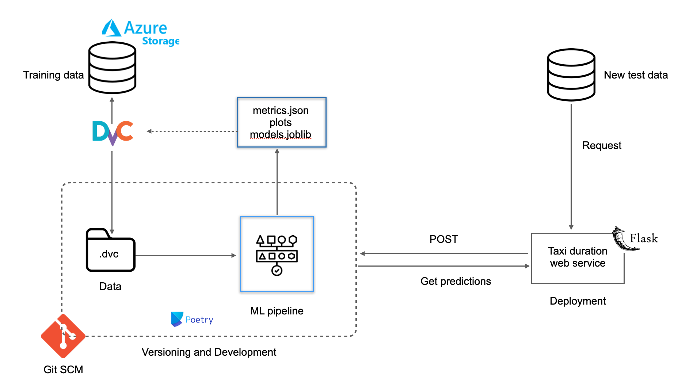
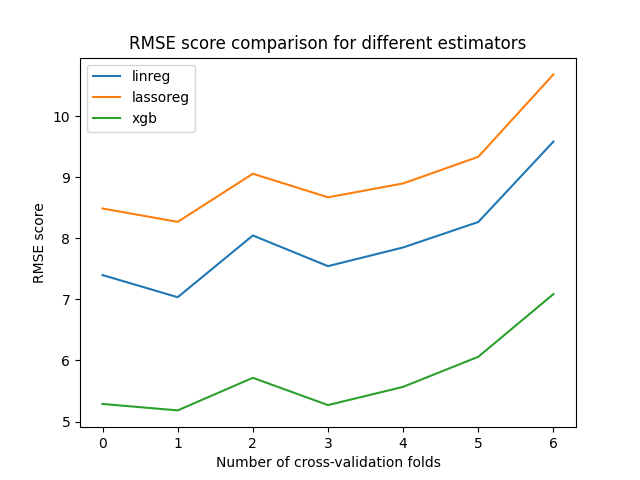

## Deploying a Machine Learning Model as a REST API Using Flask

Taxi duration prediction web service deployed as a REST API using Flask. The image shows the flow of the project.



## Steps

- Dependency management with poetry: Use poetry to add packages and also create a virtual env. The libraries required for this project are all listed (with versions) inside the pyproject.toml file

**`poetry add, poetry lock , poetry shell`**

- Authorization and authenticate of Azure Cloud account: The data, metrics, plots and models will be versioned using Data Version Control (DVC) and pushed to Azure Cloud. Therefore, first autheticate the access to your cloud account. There are several ways to do [this](https://learn.microsoft.com/en-us/azure/storage/common/authorize-data-access). I simply added the account name and key as environment variables:

```python
export AZURE_STORAGE_ACCOUNT='...'
export AZURE_STORAGE_KEY='...'
```

- Initialize DVC and configure local storage to azure remote storage: Like Git, DVC is a versioning tool. However, it versions and track large data files that can't be tracked by Git. Why is versoning our data, model important? ML models are built using data which is dynamic in nature. Thus to allow for reproducibility, reusability and collaboration. More importantly, at any point in time we should be able to revert back to an older version of data or model if needed. Read more about DVC [here](https://dvc.org/doc). The following commands, (1) adds our data to DVC for tracking, (2) adds/modifies the remote url where our data will be stored in Azure, (3) push data to the remote url on azure (note: make sure ypu create a container on azure, if not then a new one will be created)

```python
dvc add data/...
dvc remote add -d my-remote CONTAINER_URL
dvc remote modify my-remote url azure://CONTAINER_NAME/
dvc push
```
- Understand your data: Perform EDA, visualize data and get information about the input features and target. I've used a Jupyter Notebook to play around and do EDA. 

- Build ML script: In the early phases of ML projects, you can usually get by with running units of code in a Jupyter Notebook. While conducting data analysis or building POCs this surely has its benefits: you can iterate quickly and change code and parameters on the fly. However, as your project grows, structure and automation become beneficial. Maturity models such as Microsoft's list automated training as an essential step towards MLOps maturity. In order to enable this automated training, we must treat our entire ML process as a single unit. Rather than taking each step in the Notebook manually, we can "codify" a pipeline that we can execute with one command. We want it to be reliable and reproducible, while requiring as little human interaction as possible. Additionally, avoid hard coding variables. I've used a params.yaml file to store all my configurations and group them based on train, preprocess, validation. The scripts for each step (loading data, preprocess, training and validation) in the ML cycle are inside the src folder. To execute each script, run the command:

```python
python src/load_data.py --config=params.yaml
```

- Workflow orchestration with DVC: To run all the stages as a pipeline we can use DVC. The dvc.yaml file stores info about each stage, such as the name, cmd, dependencies, parameters, outputs. By running the following command, DVC will automate the pipline and run all the stages at one go:

```python
dvc repro
```

- Push all data, metrics to the cloud: On running the above command, each stage generates metadata, plots, metrics, etc, which are tracked by DVC. Here's a plot that compares the performance of the three regressors used, i.e., linear regression, lasso regression and XGBoost regreesor:



These metadata files are pushed to the Azure cloud using the following command: 

```python
dvc push
```

- Deploy model as a REST API using Flask: The model is containerised and deployed as a web service using flask. Furthermore, test data cases are posted to the deployed API (see deployable-web-service/test.py) and in return the duration of the taxi ride is returned as output. 